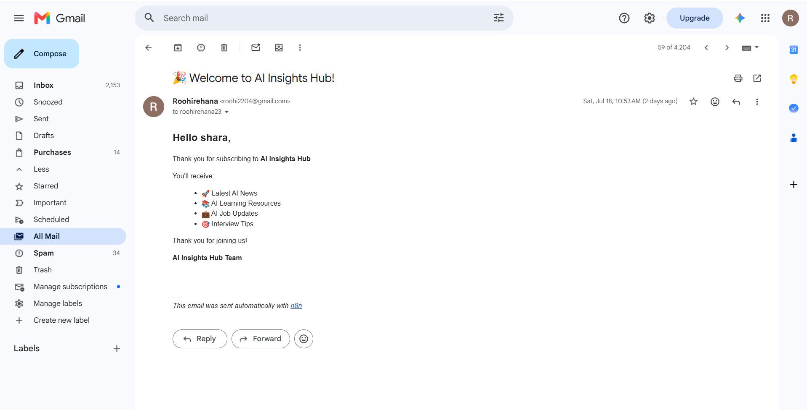

# 🤖 AI Newsletter Automation

An AI-powered newsletter automation platform built using **n8n**, **Google Gemini AI**, **Google Sheets**, **Gmail**, **RSS feeds**, and **Lovable**.

## 🚀 Features

- 📥 User subscription landing page
- 📧 Automatic welcome email
- 📰 Daily AI news collection from RSS feeds
- 🤖 AI-generated newsletter using Gemini
- 👀 Manual preview & approval before sending
- 📤 Automatic email delivery to subscribers
- 📊 Subscriber management using Google Sheets

---

## 🛠 Tech Stack

- n8n
- Google Gemini AI
- Gmail API
- Google Sheets API
- RSS Feed
- Lovable
- GitHub

---

## 📂 Project Structure

```
AI-Newsletter-Automation/
│
├── workflow/
│   └── AI Newsletter.json
│
├── screenshots/
│   ├── landing-page.png
│   ├── subscribe-form.png
│   ├── welcome-email.png
│   ├── daily-digest.png
│   └── workflow.png
│
└── README.md
```

---

## 🔄 Workflow

1. User subscribes through the landing page.
2. Subscriber information is stored in Google Sheets.
3. Welcome email is automatically sent.
4. Every morning, AI news is collected from RSS feeds.
5. Gemini AI generates a newsletter.
6. Newsletter is sent for manual approval.
7. Approved newsletters are emailed to all subscribers.

---

## 📸 Screenshots

### Landing Page


### Subscription Form


### Welcome Email



### Daily AI Digest


### n8n Workflow


---

## 👩‍💻 Author

**Roohi Rehana Begum**

B.Tech – Artificial Intelligence & Machine Learning
